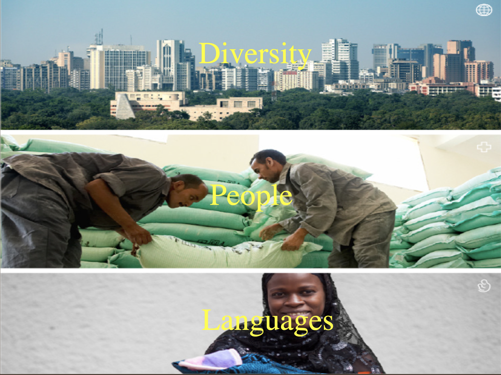

#Sociolinguistics
Why do we speak differently from our grandparents? Why do speakers from different areas sound differently? What do we mean when we say this person sounds like a doctor? Why languages change and how do we study language change? How do linguists study language variation? This class provides an introduction to Sociolinguistics. We will cover the following topics:

(a) sociophonetics: approaches, methodologies, and ethics.

(b) field studies and data collection.

(c) phonetic/phonological variation.

(d) language change.

This class is essentially a trip into language and society. We will meet the main practitioners of the field. We will try to uncover the philosophies that underlie their thought and the ideas that formed their approaches. We will explore thoroughly the phonemic systems of languages and try to uncover the reasons of change.